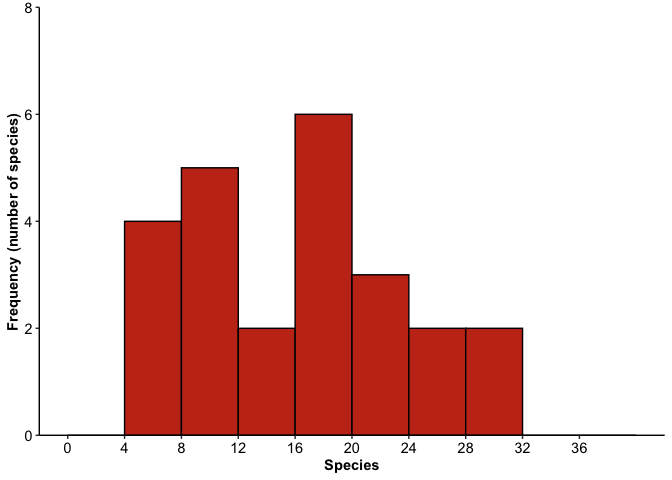
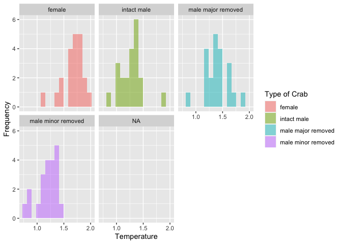
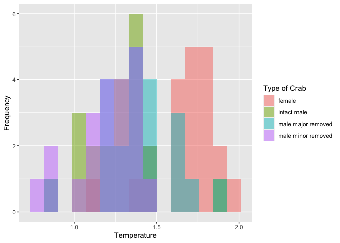

Lab 6 Comparing two means
================
Nathan Snell

Researchers studying the number of electric fish species living in
various parts of the Amazon basin were interested in whether the
presence of tributaries affected the local number of electric fish
species in the main rivers (Fernandes et al. 2004).

They counted the number of electric fish species above and below the
entrance point of a major tributary at 12 different river locations.

The data is provided in your GitHub repository.

For each question below, write a sentence answering the question and
show the code you used to come up with the answer, if applicable.

## Question A

> What is the mean difference in the number of species between areas
> upstream and downstream of a tributary? What is the 95% confidence
> interval of this mean difference. Show your code and write a sentence
> giving your answer

ANSWER

The mean difference in the number of species between areas upstream and
downstream of a tributary is 1.8334. The 95% confidence interval of this
mean difference is -4.587031 to 8.253697.

### Load packages

``` r
library(tidyverse)
```

    ## ── Attaching packages ─────────────────────────────────────── tidyverse 1.3.0 ──

    ## ✓ ggplot2 3.3.3     ✓ purrr   0.3.4
    ## ✓ tibble  3.0.5     ✓ dplyr   1.0.3
    ## ✓ tidyr   1.1.2     ✓ stringr 1.4.0
    ## ✓ readr   1.4.0     ✓ forcats 0.5.0

    ## ── Conflicts ────────────────────────────────────────── tidyverse_conflicts() ──
    ## x dplyr::filter() masks stats::filter()
    ## x dplyr::lag()    masks stats::lag()

``` r
fish <- read_csv("chap12q19ElectricFish.csv")
```

    ## 
    ## ── Column specification ────────────────────────────────────────────────────────
    ## cols(
    ##   tributary = col_character(),
    ##   speciesUpstream = col_double(),
    ##   speciesDownstream = col_double()
    ## )

``` r
fish
```

    ## # A tibble: 12 x 3
    ##    tributary  speciesUpstream speciesDownstream
    ##    <chr>                <dbl>             <dbl>
    ##  1 Içá                     14                19
    ##  2 Jutaí                   11                18
    ##  3 Japurá                   8                 8
    ##  4 Coari                    5                 7
    ##  5 Purus                   10                16
    ##  6 Manacapuru               5                 6
    ##  7 Negro                   23                24
    ##  8 Madeira                 29                30
    ##  9 Trombetas               19                16
    ## 10 Tapajós                 16                20
    ## 11 Xingu                   25                21
    ## 12 Tocantins               10                12

``` r
fish_long <- 
  pivot_longer(fish, speciesUpstream:speciesDownstream,
               names_to = "location",
               values_to = "species") %>% 
  mutate(location = str_remove(location, c("species"))) %>% 
  print()
```

    ## # A tibble: 24 x 3
    ##    tributary location   species
    ##    <chr>     <chr>        <dbl>
    ##  1 Içá       Upstream        14
    ##  2 Içá       Downstream      19
    ##  3 Jutaí     Upstream        11
    ##  4 Jutaí     Downstream      18
    ##  5 Japurá    Upstream         8
    ##  6 Japurá    Downstream       8
    ##  7 Coari     Upstream         5
    ##  8 Coari     Downstream       7
    ##  9 Purus     Upstream        10
    ## 10 Purus     Downstream      16
    ## # … with 14 more rows

``` r
fish_long
```

    ## # A tibble: 24 x 3
    ##    tributary location   species
    ##    <chr>     <chr>        <dbl>
    ##  1 Içá       Upstream        14
    ##  2 Içá       Downstream      19
    ##  3 Jutaí     Upstream        11
    ##  4 Jutaí     Downstream      18
    ##  5 Japurá    Upstream         8
    ##  6 Japurá    Downstream       8
    ##  7 Coari     Upstream         5
    ##  8 Coari     Downstream       7
    ##  9 Purus     Upstream        10
    ## 10 Purus     Downstream      16
    ## # … with 14 more rows

``` r
t.test(formula= species ~ location, data= fish_long)
```

    ## 
    ##  Welch Two Sample t-test
    ## 
    ## data:  species by location
    ## t = 0.59249, df = 21.81, p-value = 0.5596
    ## alternative hypothesis: true difference in means is not equal to 0
    ## 95 percent confidence interval:
    ##  -4.587031  8.253697
    ## sample estimates:
    ## mean in group Downstream   mean in group Upstream 
    ##                 16.41667                 14.58333

## Question B

> Test the hypothesis that the tributaries have no effect on the number
> of species of electric fish.

ANSWER

The t-test shows that there is no significant difference between the
species and the location since P \> 0.05 (t = 0.59249, df = 21.81, p =
0.5596). The difference between means falls in the 95% confidence
interval. Therefore, we fail to reject the null hypothesis. For this
reason we can say that the tributaries have no effect on the number of
species of electric fish.

``` r
t.test(formula= species ~ location, data= fish_long)
```

    ## 
    ##  Welch Two Sample t-test
    ## 
    ## data:  species by location
    ## t = 0.59249, df = 21.81, p-value = 0.5596
    ## alternative hypothesis: true difference in means is not equal to 0
    ## 95 percent confidence interval:
    ##  -4.587031  8.253697
    ## sample estimates:
    ## mean in group Downstream   mean in group Upstream 
    ##                 16.41667                 14.58333

## Question C

> State the assumptions that you had to make to complete parts (A) and
> (B). Create a graph to assess whether one of those assumptions was
> met.

ANSWER

To complete part A and B we had to assume that the scale of assumption
follows an ordinal scale, the saple of the population was collected
randomly, the data follows a normal curve, and equal variance between
sets exists when standard deviations of samples are about equal. As you
can see in the histogram, the number of species found at heach site
follows a normal curve.

``` r
ggplot(data = fish_long) +
  geom_histogram(mapping = aes(x = species), binwidth = 4,
                 boundary = 0, closed = "left", 
                 fill = "#C5351B", color = "black") +
  labs(x = "Species", y = "Frequency (number of species)") +
  scale_y_continuous(breaks = seq(0, 8, 2), limits = c(0, 8), 
                     expand = expansion(mult = 0)) +
  scale_x_continuous(breaks = seq(0, 36, 4), limits = c(0, 40)) +
  theme_classic() +
  theme(
    axis.title = element_text(face = "bold"),
    axis.text = element_text(color = "black", size = rel(1)))
```

<!-- -->

## ANOVA

Fiddler crabs are so called because males have a greatly enlarged
“major” claw, which is used to attract females and to defend a
burrow.

Darnell and Munguia (2011) recently suggested that this appendage might
also act as a heat sink, keeping males cooler while out of the burrow on
hot days.

To test this, they placed four groups of crabs into separate plastic
cups and supplied a source of radiant heat (60-watt light bulb) from
above. The four groups were intact male crabs, male crabs with the major
claw removed; male crabs with the other (minor) claw removed (control);
and intact female fiddler crabs.

They measured the body temperature of crabs every 10 minutes for 1.5
hours. These measurements were used to calculate a rate of heat gain for
every individual crab in degrees C/log minute. Rates of heat gain for
all crabs are provided in the accompanying data file.

### Question D

Graph the distribution of body temperatures for each crab type:

``` r
crabs <- read_csv("chap15q27FiddlerCrabFans.csv")
```

    ## 
    ## ── Column specification ────────────────────────────────────────────────────────
    ## cols(
    ##   crabType = col_character(),
    ##   bodyTemperature = col_double()
    ## )

``` r
crabs
```

    ## # A tibble: 85 x 2
    ##    crabType bodyTemperature
    ##    <chr>              <dbl>
    ##  1 female               1.9
    ##  2 female               1.6
    ##  3 female               1.4
    ##  4 female               1.1
    ##  5 female               1.6
    ##  6 female               1.8
    ##  7 female               1.9
    ##  8 female               1.7
    ##  9 female               1.5
    ## 10 female               1.8
    ## # … with 75 more rows

``` r
crabs %>% 
  ggplot(aes(x = bodyTemperature)) +
  geom_histogram(
    aes(fill = crabType ), 
    bins = 15, 
    alpha = 0.5,
    position= "identity",
    na.rm = TRUE)+
  labs(x= "Temperature", y="Frequency", fill="Type of Crab")+
  facet_wrap(~crabType)
```

<!-- -->

``` r
crabs %>% 
  ggplot(aes(x = bodyTemperature)) +
  geom_histogram(
    aes(fill = crabType ), 
    bins = 15, 
    alpha = 0.5,
    position= "identity",
    na.rm = TRUE)+
  labs(x= "Temperature", y="Frequency", fill="Type of Crab")
```

<!-- -->

### Question E

Does body temperature varies among crab types? State the null and
alternative hypothesis, conduct and ANOVA, and interpret the results.

The null hypothesis would be that there is no significant difference
between body temperature of the crab types. The alternative hypothesis
is that there is a significant difference between body temperature of
the crab types.

``` r
aov_crabs <-
  aov(bodyTemperature ~ crabType, data = crabs)
aov_crabs
```

    ## Call:
    ##    aov(formula = bodyTemperature ~ crabType, data = crabs)
    ## 
    ## Terms:
    ##                 crabType Residuals
    ## Sum of Squares  2.641310  3.467619
    ## Deg. of Freedom        3        80
    ## 
    ## Residual standard error: 0.2081952
    ## Estimated effects may be unbalanced
    ## 1 observation deleted due to missingness

``` r
summary(aov_crabs)
```

    ##             Df Sum Sq Mean Sq F value Pr(>F)    
    ## crabType     3  2.641  0.8804   20.31  7e-10 ***
    ## Residuals   80  3.468  0.0433                   
    ## ---
    ## Signif. codes:  0 '***' 0.001 '**' 0.01 '*' 0.05 '.' 0.1 ' ' 1
    ## 1 observation deleted due to missingness

The results show that there is a significant difference of temperatures
between crab types. We know this because the F value is not close to 1
and the P value is smaller than 0.05. Therefore, we can reject the null
hypothesis.
